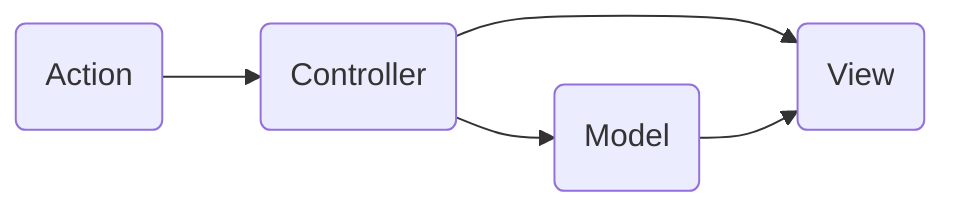
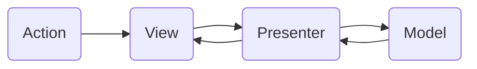
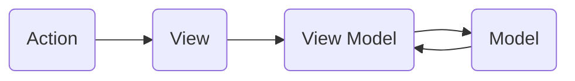

## 디자인 패턴
설계 문제에 대한 해답을 문서화 하기 위해 고안된 형식 방법이다. 건축학에서 부터 발전하였다.
Gof(Gang of Four)라 불리는 네명의 컴퓨터 과학 연구자들이 쓴 서적 'Design Patterns: Elements of Reusable Object-Oriented Software('재이용이 가능한 객체지향 소프트웨어의 요소')'이다.

## MVC

Model, View, Controller로 구성되어 있다.
1. Action은 Controller로 전달
2. Controller는 사용자 Action을 학인하고, Model을 업데이트 한다.
3. Controller는 Model을 표현할 View를 선택
4. View는 Model을 이용해 화면을 표현한다.

### 특징
Controller는 1:n으로 view와 연결됨
Controller는 View를 선택할 뿐 직접 업데이트는 하지 않는다? (View는 Controller를 알지 못함)

### 장점
단순

### 단점 
View와 Model의 의존성이 높다.

## MVP

Model, View, Presenter로 구성되어 있다.
Presenter는 View에서 요청한 정보로 Model을 가공하여 View에게 전달해 준다. 

### 특징
Presenter는 View와 1:1 관계이다.

### 장점
1. View와 Model의 의존성이 없다.

### 단점
1. 복잡해 질수록 View와 Presenter 사이의 의존성이 강해진다.

## MVVM

Model, View, View Model로 구성되어 있다.
View Model은 View를 표현하기 위해 만든 View를 위한 Model이다.

### 특징
MVVM패턴은 Command 패턴과 Data Binding 두가지 패턴을 사용하여 구현되었다.
ViewModel과 View는 1:n 관계이다.

### 장점
1. View와 Model 사이의 의존성을 없앴다.

### 단점
1. View Model의 설계가 쉽지 않다.

